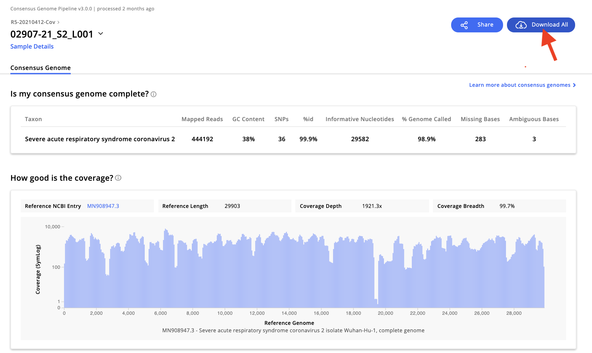
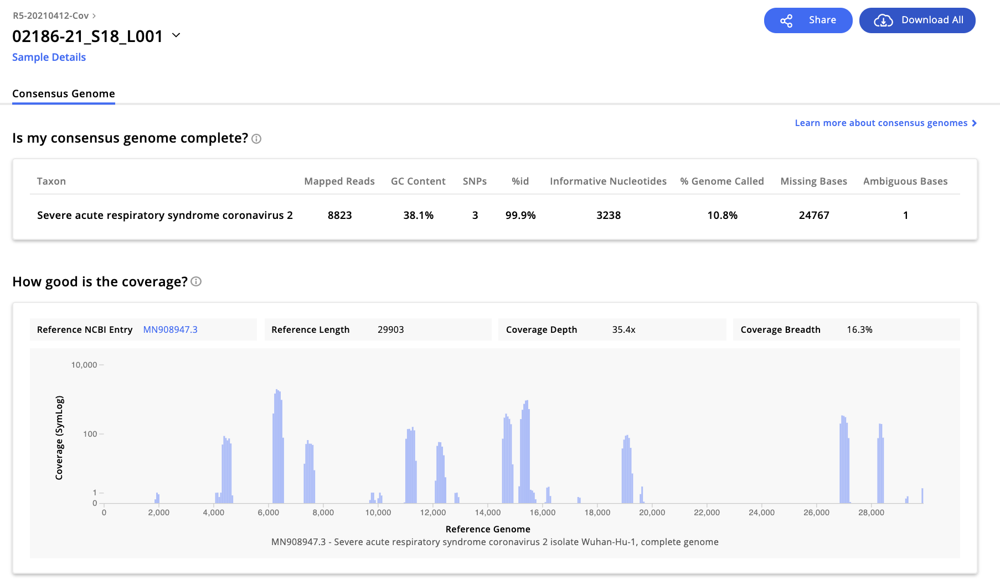

# SC2-genome-curation

This site hosts the scripts needed to curate SARS-CoV-2 consensus genomes produced in part with our Next Generation Sequencing collaboration with [Institut Pasteur of Madagascar](http://www.pasteur.mg/) collaboration. Consensus genomes are produced from a Nexflow pipeline on [IDseq.net](IDseq.net) after upload of raw .fastq files from . The scripts stored here can be run on the resulting IDseq output, manually curated, then uploaded to GISAID.org.

Step-by-step instructions for genome curation on a new sequencing project are as follows:

---

 1. Create a parent folder for the new IDSeq project. Download all "metadata" folders for each genome in that project, unzip, and store as subfolders in the parent folder. Each genome's metadata folder must currently be downloaded individually, though the IDseq team is working to amend this. This means you will have to individually click on each genome, selecting the "Download All" option in the upper right, unzip the folder and move it manually into your parent folder.
 


Once this is done, double check that you got all the genomes from the project! **You can skip downloads for any genomes that have poor coverage (e.g. <85%).** They will look like this--no need to download!



**If you skip a genome, please update the "genomes-for-resequencing.csv" file in this database with the run name and ID_Viro for the sample in question.**

---

2. Move the following files into the parent folder (all files are stored in the "scripts-and-data" subfolder of this github repo, with a blank example of the meta_df.csv file):

- copy-scripts.R
- sequence-pipeline.R
- MN908947.3.fa
- merge-meta-plot.R
- loop-COVID-seq.txt
- meta_df.csv
- make-manual-cns.R

*The "meta_df.csv" folder should include the appropriately structured metadata. The following columns are REQUIRED for the script to run: ID_IDSeq, ID_Viro, sample_collection_date, and Ct. A blank meta_df.csv is included here for reference.* As a default, I like to enter the Orf1b Ct values that come off the TaqPath qPCR assay, but sometimes you will be working with GeneXpert samples that report N2. It does not really matter what you use here for Ct, but you need to enter some value, as it will determine the order of the sequences in the cumulative reads per million coverage plot that the "merge-meta-plot.R" script produces. In the event that the metadata provided does not include collection date and/or Ct, you can fill in dummy variables (i.e. today's date or NA) for these columns. 

---

3. In terminal, cd into the parent folder, and run the processing script with the line:

```
    sh -e loop-COVID-seq.txt 
```
The above script produces the following outputs:
- A summary file, "sequence_summary.csv", that summarizes the following information across each genome in the dataset: ID_Viro, seq_name, total_reads, coverage, n_missing, Ct, sample_collection_date, avg_depth, totN, totAmbiguous, totSNP.
- A more detailed summary file, "seq_check_manual.csv", that lists all the positions of the Ns, Ambiguities, and SNPs for each genome in the project. 
- An image file "all-seq-rpm.png" that shows the reads per million genome coverage for all genomes in the dataset, ordered by increasing Ct value.
- Within each folder, it will generate a .tsv file ("SEQNAME_all.tsv") with the position and nucleotide identity of each basepair, where it also flags Ns, Ambiguities, and SNPs.

---

4. Now it is time to manually check the Ns and Ambiguities in [Geneious](geneious.com) by:
- Make a sub-folder for each genome in Geneious.
- Add the reference sequence (MN908947.3.fa) to each subfolder, then add the "aligned_reads.bam" file for each genome to the corresponding subfolder. The reads should map to the reference.
- If you wish, you can also add the corresponding .bed file from the parent folder, but I often find it is easier to just scroll through the .tsv file.
- Within the genome output subfolder, copy the newly formed .tsv file ("SEQNAME_all.tsv") into a new file with the name "SEQNAME_all_manual.tsv"."
- Open "SEQNAME_all_manual.tsv", then add a column to the right of "cns" that duplicates "cns" but has the header "cns_manual". 
- Then scroll down the "flagN" and "flagAmbiguous" columns for any values of 1 and examine these genome positions in Genious. If the nucleotide is marked as "N", you can manually resolve it by changing the basepair in the "cns_manual" column to an accurate identity. As a rule, we will only accept manual edits that are uncontested (i.e. 100% agreement at that site) down to 3 reads per site. If the site is an ambiguity, you can resolve this manually in the same way: for ambiguities, there are no hard rules about number of reads, but you should only resolve the ambiguity if you are 100% confident that the selected conclusion is erroneous. In the event of an insertion, add a row in the .tsv file and type "insertion" in the "position" column such that the basepairs mapping to the reference genome still maintain the reference genome's official position number.
- Continue this process until you have examined ALL the Ns and Ambiguities in the genome, then save the "SEQNAME_all_manual.tsv" file.

---

5. Once you have completed the above process for all genomes, from terminal in the parent folder, pull the manually edited tsvs from each genome subfolder into the parent folder, using this script:

```
mkdir manual-tsv
cd manual-tsv
cp /path_to_folder/*_outputs/*_manual.tsv .
```

---

6. Then concatenate all tsv files with:

```
cat *tsv > all_manual.tsv
mkdir consensus-manual

```

---

7. Then  run R script to generate new manual consensus files and store in above folder, along with a  final mutation and ambiguities summary file.

```
Rscript make-manual-cns.R
```

---

8. Concatenate all the manually-edited genomes and upload to check genome integrity on [Nextclade](https://clades.nextstrain.org/). Decide what to submit to GISAID.

9. Work with Cara to update all metadata for genomes going to GISAID in the running metadata file.


