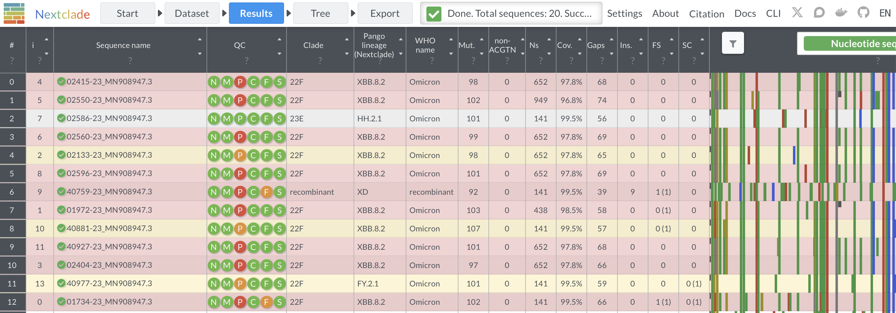
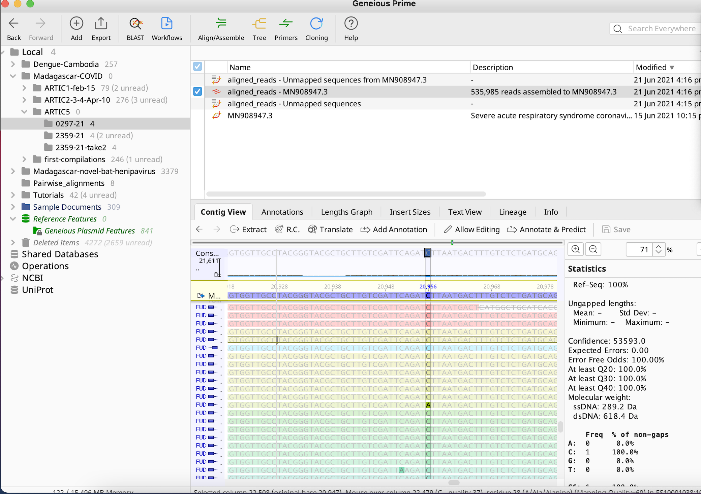

# SC2-genome-curation

This site hosts the scripts needed to curate SARS-CoV-2 consensus genomes produced in part with our Next Generation Sequencing collaboration with [Institut Pasteur of Madagascar](http://www.pasteur.mg/) collaboration. Consensus genomes are produced from a Nextflow pipeline on [CZID.org](czid.org) after upload of raw .fastq files from IPM. The scripts stored here can be run on the resulting CZID consensus genome output, manually curated, then uploaded to GISAID.org.

Step-by-step instructions for genome curation on a new sequencing project are listed below. We will use the '[Oct_01](https://czid.org/my_data?currentDisplay=table&currentTab=samples&mapSidebarTab=summary&projectId=9492&showFilters=true&showStats=true&updatedAt=2024-02-13T02%3A54%3A34.041Z&workflow=consensus-genome)' CZID project as a reference to guide our process as follows:

---

1. First, download all the consensus genomes with coverage >90% from your CZID project into one concatenated file. To do this, click on the box to the left of each sequence you wish to select in the folder, then (once you have selected all you wish to include) click the 'Download' cloud button to download, and choose the following option:


---

2. After your concatenated consensus genome file downloads in step 1, navigate to [Nextclade](https://clades.nextstrain.org/export) on your web browser and drag your concatenated consensus genome file onto the "Provide sequence data" window.


---

3. Let Nextclade run (it will take a few minutes) until it has processed all of your genomes to produce a screen that looks something like this:


---

4. Any sequence that comes up with all green circles (like sequence #2 in the image above) should be fine to submit as is. Additionally, any sequence that has all green circles and one orange circle for "N" should also be fine to submit as is. 

---

5. For any remaining sequences that are flagged with orange or red circles under the "private mutations" circle, we are going to convert and "reversion mutations" or any "labeled mutations" to "N" and then rerun in Nextclade. You can read about these mutation classifications on the Nextclade website [here](https://docs.nextstrain.org/projects/nextclade/en/stable/user/algorithm/07-quality-control.html) under the 'Private mutations' section of the Quality Control page. Here's a good example of a reversion mutation clearly due to a faulty computational pipeline that failed to trim an adaptor sequence:


In the case of above, the entire subclade of the Oct1 folder has this reversion -- the homoplasy is clearly visible when you click on the "Tree" tab in Nextclade and zoom in on this cluster:


Before leaving Nextclade, download the output '.tsv' file corresponding to the reversion substitutions and labeled substitutions that have been identified in your dataset. You can navigate to this in the "Export" button of Nextclade and select the appropriate categories listed here:


---

6. Now, it is time to download the composite metadata files for all sequences in your dataset that you plan to curate. To do this, create a parent folder for the new CZID project on your home computer. Download all "metadata" folders for each genome in that project that you wish to curate. These can be downloaded in bulk by checking all sequence folders in the project that you wish to download, then selecting the cloud 'Download' button in the upper righthand corner of the screen. 
 


After clicking the 'Download' cloud button, now select the "Intermediate Output Files" option and unzip the corresponding folders after they have downloaded. Move them into your parent folder on your home computer. Once this is done, double check that you have a folder for all genomes you hope to curate in your parent folder. 


---

7. Now, make a sub-folder outside and adjacent to your 'parent' folder labeled 'to-submit' and drag the consensus genome files (ending in 'consensus.fasta') corresponding to those that do not need editing into this subfolder. To avoid confusion, go ahead and delete the metadata folders for these sequences from your parent folder after you have dragged them. For the Oct_01 example, only sequence '02586-23' is ready for submission without curation.

---

8. Now, move the following files into the parent folder (all files are stored in the "scripts-and-data" subfolder of this github repo, with a blank example of the meta_df.csv file):

- copy-scripts.R
- sequence-pipeline.R
- MN908947.3.fa
- merge-meta-plot.R
- loop-COVID-seq.txt
- meta_df.csv
- make-manual-cns.R
- curate-mutations.R

*The "meta_df.csv" folder should include the appropriately structured metadata. The following columns are REQUIRED for the script to run: ID_IDSeq, ID_Viro, sample_collection_date, and Ct. A blank meta_df.csv is included here for reference.* If you are the same person who did the sequencing, then you likely have this metadata already from your preparation of the samples for upload to CZID. Note that you will need to add the information in the "ID_CZID" column. This should be whatever the ID is listed internally in CZID -- you can find this within each genome subfolder in the stats.json file (this can be opened in a TextEditor), or as a prefix to the file that ends in "muscle.out.fasta". For whatever reasons, this name appears to sometimes be different from the sequence title on CZID -- you will *need* to use the name in the .json file.

As a default in the metadata, I like to enter the Orf1b Ct values that come off the TaqPath qPCR assay, but sometimes you will be working with GeneXpert samples that report N2. It does not really matter what you use here for Ct, but you need to enter some value, as it will determine the order of the sequences in the cumulative reads per million coverage plot that the "merge-meta-plot.R" script produces. In the event that the metadata provided does not include collection date and/or Ct, you can fill in dummy variables (i.e. today's date or NA) for these columns. 

For the Oct_01 example, subsetting the metadata file that Aina has already provided should be sufficient.

**In addition, move the 'nextclade.tsv' file that you downloaded in step #5 into this folder!**

---

9. Now, in terminal, cd into the parent folder, and run the processing script with the line:

```
    sh -e loop-COVID-seq.txt 
```
The above script produces the following outputs:
- A summary file, "sequence_summary.csv", that summarizes the following information across each genome in the dataset: ID_Viro, seq_name, total_reads, coverage, n_missing, Ct, sample_collection_date, avg_depth, totN, totAmbiguous, totSNP.
- A more detailed summary file, "seq_check_manual.csv", that lists all the positions of the Ns, Ambiguities, and SNPs for each genome in the project. 
- An image file "all-seq-rpm.png" that shows the reads per million genome coverage for all genomes in the dataset, ordered by increasing Ct value.
- Within each folder, it will generate a .tsv file ("SEQNAME_all.tsv") with the position and nucleotide identity of each basepair, where it also flags Ns, Ambiguities, and SNPs.
- It also produces an edited file ("SEQNAME_all_manual.tsv") that includes an additional column entitled "cns_manual", in which all reversion mutations and labeled private mutations flagged by Nextclade have been reverted to "Ns".

---

10. If you are short on time, proceed to step #12 below. You should be able to pull your edited files after replacing the private mutations with Ns into a central folder to make new consensus genomes for upload to GISAID.

11. If you have enought time, then it is always a good idea to manually edit your genome files. . There are three types of corrections you can make, using Geneious: you can resolve private mutations, check the Ns and Ambiguities in [Geneious](geneious.com) by:
- Make a sub-folder for each genome in Geneious.
- Add the reference sequence (MN908947.3.fa) to each subfolder, then add the "aligned_reads.bam" file for each genome to the corresponding subfolder. The reads should map to the reference.
- If you wish, you can also add the corresponding .bed file from the parent folder, but I often find it is easier to just scroll through the .tsv file.
- Open "SEQNAME_all_manual.tsv". Freeze the panes on the top row of your database so you can see the headers as you scroll down.
- First, check for any insertions. To do this, search the "refseq" column for any dashes. **All insertions should be visible as a dash in the refseq column.** If you find any, you will notice that the "position" column continues its sequence from top to bottom. This is incorrect because that position should reflect the nucleotide identity of the reference genome, and there is no reference nucleotide at that place. To amend this, you should insert a row for each dash, type the word "insert" in the position column, and copy the consensus genome information into that row. Then, you should realign the "position" column so the numbering resumes after the insertion.
    - Here is an example of a sequence that needs an insertion to be called (between position 26493 and 26494): 
    - And here is how you would edit it:
    
- After resolving any insertions (they are not super common), scroll down the "flagN" and "flagAmbiguous" columns for any values of 1 and examine these genome positions in Geneious. If the nucleotide is marked as "N" or "Ambiguous"", you can manually resolve it by changing the basepair in the "cns_manual" column to an accurate identity. Here are some rules for making a call:
    - If the basepair is flagged as "N", and has fewer than 10 reads at that site, you can manually edit it if there are 3 or more reads at that site which ALL agree with the reference genome. 
    - If the basepair is flagged as "N", and has MORE than 10 reads per site, you can manually edit it to the reference genome if 95% or more of the reads at that site match to the reference. Note that you can visualize the percent of each nucleotide per genome position in the "Statistics" tab of Geneious, but you have to be sure to highlight the column at the top of the consensus genome so that you first see an arrow from the cursor before the highlight. It will give you a read-out like this: 
    Note that if you see claims of 100% of a given nucelotide upon highlight, you likely did not highlight the column correctly. Here is the same column highlighted incorrectly because I did not wait for the arrow to materialize above the consensus genome:  
    - If the basepair is flagged as "N" and there are fewer than 3 reads at that site, or if you would be changing it to a mutation, or if it has <10 reads with any disagreement at all, it should be left as "N".
    - If the  basepair is flagged as an Ambiguity, you can resolve this manually in the same way: for ambiguities, there are no hard rules about number of reads, but you should only resolve the ambiguity if you are 100% confident that the selected conclusion is erroneous. In general, you will find that >75% of the nucleotides match the resolved result, but it is okay to resolve at lower proportions if you feel confident about the outcome.
    
- Continue this process until you have examined ALL the Ns and Ambiguities in the genome, then save the "SEQNAME_all_manual.tsv" file.

---

12. Once you have completed the above process for all genomes, from terminal in the parent folder, pull the manually edited tsvs from each genome subfolder into the parent folder, using this script:

```
mkdir manual-tsv
cd manual-tsv
cp /path_to_folder/*_MN908947.3/*_manual.tsv .
```

Note that "path_to_folder" should be replaced with the path to your parent directory on your home computer! For example, on my computer, I would type the following for line 3 of the above code:

```
cp /Users/carabrook/Developer/COVID-Madagascar/ARTIC5/*_MN908947.3/*_manual.tsv .
```

*A tip for command line coding*: The above is telling the computer to "copy" ALL of the files ending in _manual.tsv (that's the asterisk) from ALL of the sub-folders ending in _output to the folder where your cursor is currently located (manual-tsv). The space followed by the period (" .") means copy it here, to the folder I am currently located in. You could specify the path to this location--the current script is just a shortcut.

Of course, you COULD drag all the files into the folder manually, but it is best to practice the command line code.

---

13. Then, still located in the manual-tsv subfolder, concatenate all tsv files with:

```
cat *tsv > all_manual.tsv
mkdir consensus-manual

```

---

14. Now, use the command "cd" to "back-up" one folder so that you are back in the parent directory. Then, run R script to generate new manual consensus files and store in the sub-sub "consensus-manual" folder, along with a  final mutation and ambiguities summary file.

```
Rscript make-manual-cns.R
```

---

15. Now, you can concatenate all the manually-edited genomes. To do this, cd into the manual-consensus sub-sub-folder and use the "cat" command to concatenate. Remember that the asterisk says to do this to ALL the files ending in ".fasta":

```
cd manual-tsv
cd consensus-manual
cat *fasta > all_manual_cns_seq.fasta

```

10. Now go ahead and upload "all_manual_cns_seq.fasta" to check genome integrity on [Nextclade](https://clades.nextstrain.org/). Any sequences that are all green--and those that are shaded light blue even if they have an orange button--should be okay to upload. For any others, the red and orange buttons need to be resolved prior to submission to GISAID.

11. Post questions in the slack as you go. Work with Cara to update all metadata for genomes going to GISAID in the running metadata file.

---

## Useful command line code to manipulate genomes

To move into the next folder:

```
cd
```

To back up into the previous folder:

```
cd -
```

To back up to the original base folder:

```
cd ~
```

To add a prefix to every sequence in a compiled file:

```
awk '{if (/^>/) print ">prefix_to_add_"(++i)"_" substr($0,2); else print $0;}'  filename.fasta > new_filename_with_prefix.fasta
```

To split a compiled fasta back into the individual genome files (for uploading to Geneious, for example):

```
awk 'BEGIN {n_seq=0;} /^>/ {if(n_seq%1==0){file=sprintf("filename_for_individual_files%d.fa",n_seq);} print >> file; n_seq++; next;} { print >> file; }' < filename_for_compiled_file.fasta
```
